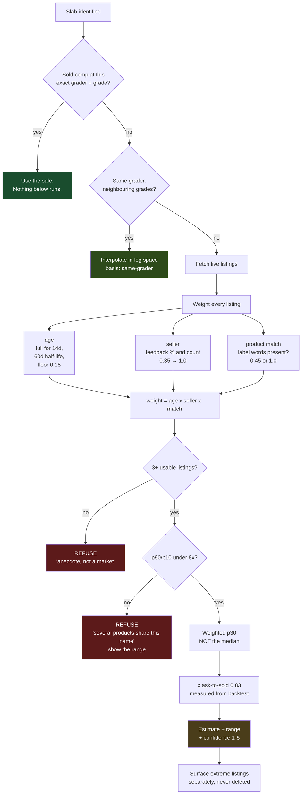

# Estimating a price when we have no sale

## What this is for, and when it runs

The valuation ladder answers "what is this holder worth" in order of evidence:

1. A completed sale of this card, at this grade, from this grading company.
2. The same company's neighbouring grades.
3. **This document** — an estimate built from the live market.
4. Nothing, said plainly.

Steps 1 and 2 are facts. Step 3 is not, and everything here exists to keep that
distinction visible rather than to blur it. It runs **only** when no sold comp
exists for the exact `(catalog_id, grader, grade)` — for us that is every card
outside English Pokemon, because our sold-comp source covers nothing else.

## The problem this has to solve

An asking price is not a value. Three things make raw asks actively dangerous
as an input:

**Asks sit above sales, systematically.** The closest well-measured analogue is
residential property, where about 84% of listings sell below their asking price
and the median discount after a reduction is over 25%. Cards are less liquid,
not more, so treating a median ask as a value is biased high by construction.

**A listing that has not sold is evidence against its own price.** A copy at
$93,500 posted thirteen months ago is not a $93,500 card. It is proof that at
$93,500 nobody bought. Age is not a nuisance in this data — it is the single
most informative field in it.

**The listings we fetch are frequently not all the same product.** A collector
number is shared by base prints, promos, parallels, signed copies and prize
cards that differ by 100x. When a card's asks run $4 to $94,000, the honest
reading is not "the average is $4,000" — it is "these are several different
products and we have mixed them".

## The shape of it

## Measured accuracy

Backtested against our own sold comps with `npm run backtest`: the estimator
sees **only live asks**, and its output is compared with a completed-sale
figure it never saw. **73 keys** across every card in the store holding a sold
comp of 8 or more sales, spanning six grading companies.

| metric | result |
|---|---|
| keys tested | 73 |
| priced | 64 |
| refused | 9 (8 too-wide, 1 too-few) |
| median absolute error | **13.3%** |
| median signed error | +2.7% (very slightly high) |
| within ±25% | **66%** |
| within ±50% | **78%** |
| implied sold ÷ weighted p30 | **0.81** against the 0.83 we apply |

Re-run it before quoting these anywhere. The market moves and so do they.

**These numbers replace an earlier, much flatter set** — 7.0% median error,
85% within ±25%, 100% within ±50% — measured over 26 pairs across six cards.
That run was not wrong so much as narrow: six well-covered cards, all of them
ones we had already been debugging, which is close to selecting on the answer.
Widening it to every key in the store put the median error at roughly double,
and that is the number to plan against.

The error is asymmetric and worth knowing about: the tail is on the HIGH side
(+380%, +204%, +137% on the worst three) and there is nothing comparable below.
That is the ask-to-sold discount being too small for cheap modern cards, where
a $27 sale sits under $83 of asks nobody is paying. The 0.81 implied factor is
a pool-wide median and hides that; a per-tier factor is the obvious next
improvement, and until it exists a low-value estimate should be read as a
ceiling rather than a midpoint.

## Signals

Everything below is either read from the listing or measured from our own data.
Nothing is a hand-written constant standing in for a market fact, per invariant
2 in CLAUDE.md.

| signal | source | why it matters |
|---|---|---|
| ask price | eBay Browse | the raw claim |
| listing age | `itemCreationDate` | an unsold ask is a ceiling, and a falling one |
| seller feedback % and count | `seller.*` | who is making the claim |
| Best Offer enabled | `buyingOptions` | the seller's own statement the number is soft |
| grader + grade in title | parsed | is this even the same tier of object |
| label/printing match | `labeltokens.ts` | is this even the same product |
| our own grade ladder | `grade_prices` | the same company's neighbouring grades |
| measured cross-grader ratio | `ratio.ts` | what other graders' prices imply |

## Method

### 1. Weight each listing, do not average them

Every listing gets a weight in `[0,1]`, the product of three factors.

**Age.** A fresh listing is a live claim; an old one is a refuted one. Full
weight up to 14 days, decaying with a half-life of 60 days, floored at 0.15 so
an old listing still counts for something — it is evidence, just weak and
pointing downward.

**Seller standing.** Feedback percentage and count together. An established
account at high feedback carries full weight; a new or low-feedback account is
discounted toward 0.35, because an unknown seller's aspirational ask is the
cheapest thing to produce on the internet. Unknown standing sits in the middle
rather than at either end.

**Product match.** A listing whose title matches the label's own words carries
full weight. One that merely shares the card number carries less — that is the
$4 sleeve and the $94,000 prize card being told apart.

### 2. Take a low quantile, not the median

Because asks are biased high, the sold price sits low in the ask distribution.
We take the **weighted 30th percentile**, not the middle. This is the single
choice that stops a median-of-asks being reported as a value.

### 3. Apply a MEASURED ask-to-sold ratio

Where we hold both a sold comp and asks for the same `(card, grader, grade)`,
their ratio is observable. We compute it across every card where both exist,
take a robust central estimate in log space, and shrink it toward the pool when
thin — the same machinery as the cross-grader ratio, for the same reason.

The pool-wide factor is **0.83**, and it is measured rather than borrowed: a
73-key backtest puts the median sold price at 0.81 of the weighted p30 of asks,
against the 0.83 in the code. It began life as 0.85 reasoned across from property data, and
landing within two points of that is reassuring — but the number in the code is
now ours.

It is still pool-wide rather than per-card, so a caller that has not measured
its own factor is told the output used an assumed one. A prior we admit to
beats a constant we hide.

### 4. Refuse when the inputs disagree

The estimate is **not produced at all** when:

- fewer than 2 usable listings survive weighting — that is anecdote, not market
- the weighted spread `p90/p10` exceeds 12x — several products are mixed, and
  averaging them describes none of them
- no listing matches the label or printing, when the label gave us words to
  match on — we are looking at other cards

In those cases the answer is the range and the listings, with no headline
number. A blank with a list beneath it is worth more than a confident average
of unrelated objects.

### 5. Return a range and a confidence, never a bare number

Output carries `low`, `estimate`, `high`, a confidence of 1–5 (Card Ladder's
scale, and for the same reason: recency and sample size are what a reader needs
to judge a figure), the weights that produced it, and one sentence of
provenance. A point estimate with no spread reads as a fact and this is not one.

## What this deliberately does not do

**It does not delete outliers.** An extreme ask is downweighted and still
shown. Deleting it is how a $94,000 listing vanished and a $4.16 median went to
the top of the page. The extreme is often the only listing that is actually the
card in hand.

**It does not use hand-written grade or grader multipliers.** Ratios are
measured from our own data or not used.

**It does not fill silence.** Where the signals do not agree, the output is the
market, not a number.

## Prior art

- **PriceCharting** — completed eBay sales, with outlier handling and
  date-of-sale weighting; blends most-recent, median, and age-weighted average.
- **Card Ladder** — completed sales from eBay, Goldin, PWCC and Heritage,
  anchored to a player/market index so a card with a stale last sale moves with
  its market, plus a 1–5 confidence meter driven by sale recency.

Both price from **sales**. Neither prices from asks, because asks are not
prices. This module exists because we do not yet have sold data outside
Pokemon, and it should be retired for any market where we get it — the eBay
Marketplace Insights application is the path.
